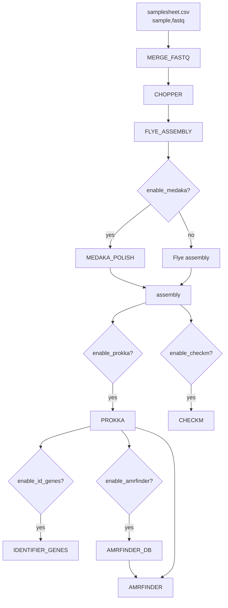

# ulana-nf

A Nextflow (DSL2) port of [ulana-ht](https://github.com/ehill-iolani/ulana-ht):
bacterial whole-genome assembly and downstream characterization from Oxford
Nanopore long reads. Flye assembly, optional Medaka polishing, Prokka
annotation, CheckM QC, marker-gene extraction, and AMRFinderPlus AMR
detection -- the same steps and feature toggles as the Snakemake original,
reimplemented so it can run standalone from a terminal *or* be launched by a
front end/backend the way [edna-ont-nf](https://github.com/ehill-iolani/edna-ont-nf)
is designed to be.

## Why a rewrite, not a wrapper

Both `ulana-nf` and `edna-ont-nf` are meant to eventually submit into the same
centralized hub for non-specialist users, so they share one integration
contract instead of each inventing its own:

- **Samplesheet schema** -- both pipelines take `--input samplesheet.csv` with
  the same two columns, `sample,fastq` (`fastq` may be a single file or a
  glob matching multiple part-files).
- **`nextflow_schema.json`** -- every `--param` is described here (type,
  default, validation, help text), grouped into the same sections a UI would
  render as a form. This is the nf-core convention specifically meant to
  drive auto-generated launch UIs (Seqera Platform, nf-core/launch, or a
  custom backend) -- a backend reads this file to build the submission form
  instead of hardcoding one per pipeline.
- **One process per tool, one container each** (`modules/*.nf`), chained by a
  single subworkflow (`workflows/ulana_wgs.nf`) that `main.nf` calls -- same
  shape as `edna-ont-nf`'s `workflows/edna_amplicon.nf`.
- **`-profile test`** -- every pipeline in the hub should be runnable against
  a small checked-in synthetic dataset with no external data, so CI (and a
  backend's own smoke test before accepting a submission) can validate the
  pipeline the same way regardless of which tool it's calling.

## What it does

1. `MERGE_FASTQ` -- merge multi-part fastq(.gz) files per sample
2. `CHOPPER` -- quality + length filtering
3. `FLYE_ASSEMBLY` -- assembly
4. `MEDAKA_POLISH` -- polish (optional, default on)
5. `PROKKA` -- annotate (optional, default on)
6. `CHECKM` -- QC (optional, default on)
7. `IDENTIFIER_GENES` -- extract 16S rRNA / dnaA / rpoB from Prokka output (optional, default on; requires Prokka)
8. `AMRFINDER_DB` + `AMRFINDER` -- AMR detection (optional, default on; requires Prokka)



## Requirements

- [Nextflow](https://www.nextflow.io/) >= 23.10.0
- One of Docker, Singularity, or Conda (every process is containerized;
  pick a profile below)

## Quickstart

```bash
nextflow run main.nf --input samplesheet.csv -profile docker
```

`samplesheet.csv` is a two-column CSV:

```csv
sample,fastq
12-45-SW-A-1,data/12-45-SW-A-1_ONT.fastq.gz
18-T-HS-3-S-2-30-S,data/18-T-HS-3-S-2-30-S_ONT.fastq.gz
```

## Parameters

See `nextflow_schema.json` for the full list with defaults and validation, or
run `nextflow run main.nf --help`. Key ones:

| Parameter | Default | Description |
|---|---|---|
| `--input` | *(required)* | Samplesheet CSV (`sample,fastq`) |
| `--outdir` | `results` | Output directory |
| `--chopper_q` / `--chopper_minlength` | `10` / `1000` | chopper quality/length filtering |
| `--flye_mode` | `--nano-hq` | Flye read-type flag |
| `--enable_medaka` / `--medaka_model` | `true` / `r1041_e82_400bps_hac_v5.0.0` | Medaka polishing |
| `--enable_prokka` | `true` | Prokka annotation |
| `--enable_checkm` | `true` | CheckM QC |
| `--enable_id_genes` | `true` | Marker gene extraction (requires `--enable_prokka`) |
| `--enable_amrfinder` | `true` | AMRFinderPlus AMR detection (requires `--enable_prokka`); DB is downloaded fresh every run |

## Output layout

```
results/
  {sample}/
    reads/            merged + filtered fastq
    assembly/flye/    assembly.fasta, assembly_info.txt, assembly_graph.gfa
    polish/medaka/    polished_consensus.fasta (only if --enable_medaka)
    annotation/prokka/  .tsv .faa .ffn .gff (only if --enable_prokka)
    qc/checkm/        summary.tsv (only if --enable_checkm)
    id_genes/         16S_rRNA.fasta, dnaA.fasta, rpoB.fasta (only if --enable_id_genes)
    amr/              amrfinder_pro_results.tsv, amrfinder_pro.fasta (only if --enable_amrfinder)
  db/amrfinder_db/    AMRFinderPlus database for this run
  pipeline_info/       Nextflow timeline/report/trace
```

## Repo structure

```
main.nf                     entry point, samplesheet parsing, --help
workflows/ulana_wgs.nf       subworkflow chaining all steps
modules/*.nf                 one process per tool, one container each
nextflow.config               param defaults, profiles, resource labels
nextflow_schema.json          JSON Schema describing every --param (for UIs/validation tooling)
conf/test.config              -profile test overrides (small synthetic dataset)
tests/data/                   small synthetic dataset used by -profile test
.github/workflows/ci.yml      runs -profile test on push/PR
```

## Testing

```bash
nextflow run main.nf -profile test,docker
```

Runs against two synthetic samples checked into `tests/data/` (see
`tests/data/generate_synthetic_reads.py` for how they were generated).
CheckM and AMRFinder are off in this profile since both need multi-GB
reference databases fetched at runtime, impractical for CI -- Prokka and
Medaka stay on since neither needs an external download.

## Relationship to ulana-ht

This is a from-scratch DSL2 reimplementation, not a Snakemake wrapper.
Behavior differs from the original in one place worth flagging:
`AMRFINDER_DB` explicitly downloads the database into its own published
directory and passes it to `AMRFINDER` via `-d`, rather than relying on
`amrfinder --force_update`'s implicit default install path -- the Snakemake
version could rely on a single shared conda env's filesystem across rules,
but each Nextflow process gets a fresh container, so the db has to be an
explicit input/output like any other file.

## Citation

Based on the ULANA pipeline concept (Unicellular Long-read Assembly aNd
Annotation). See the [ULANA paper](https://www.liebertpub.com/doi/10.1089/ast.2023.0072):

Prescott, R. D., Chan, Y. L., Tong, E. J., Bunn, F., Onouye, C. T., Handel, C., Lo, C.-C., Davenport, K., Johnson, S., Flynn, M., Saito, J. A., Lee, H., Wong, K., Lawson, B. N., Hiura, K., Sager, K., Sadones, M., Hill, E. C., Esibill, D., … Donachie, S. P. (2023a). Bridging Place-based astrobiology education with genomics, including descriptions of three novel bacterial species isolated from Mars analog sites of cultural relevance. Astrobiology, 23(12), 1348–1367. https://doi.org/10.1089/ast.2023.0072
